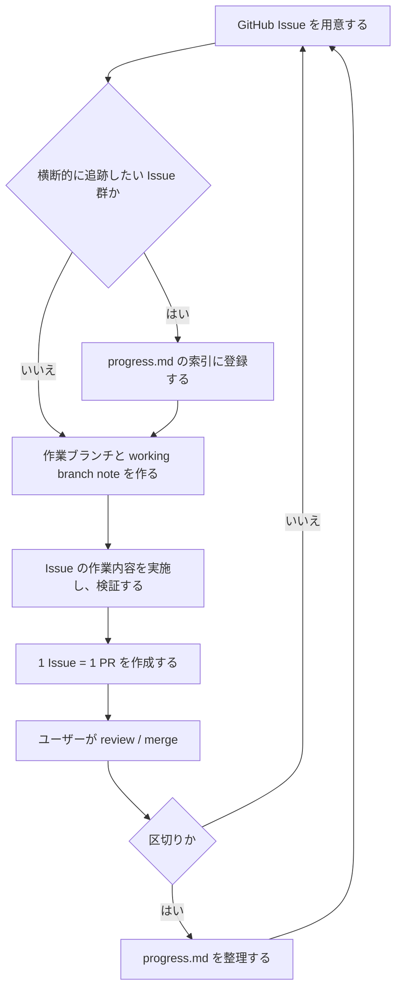

# 開発ループ入口

この文書は、bizdate で作業を始めるときに読む入口である。人間と AI agent が同じ流れを共有し、GitHub Issue / `progress.md` / PR / working branch note の役割を混ぜないために使う。

方針の経緯は `doc/design/decision-log/0012-development-loop.md` にある。詳細な手順は各 guideline を正本とし、この文書には全体の流れと参照先だけを置く。

## 基本方針

- 作業は必ず GitHub Issue から始める。
- 複数 Issue をまとめて 1 ブランチで進めない。実行時は `doc/guidelines/issue-driven-task-execution.md` に従い、1 Issue = 1 ブランチ = 1 PR とする。
- タスクは直列に消化する。複数 Issue の並行作業はしない。
- 横断的に見渡したい Issue 群は `progress.md` の進行中タスク索引に登録する。
- **PR の merge は AI agent が行わない**。レビューと merge 判断は人間が行う。

## 標準フロー

## 各資材の役割

| 資材 | 役割 |
|---|---|
| GitHub Issue | 作業の入力。背景、依存、作業内容、スコープ外、検証を置く。 |
| `progress.md` | リリース台帳と進行中タスクの索引。詳細経緯やブランチ作業ログは置かない。 |
| Pull Request | 1 Issue に対する変更単位。description には変更意図、検証、未検証事項、`Closes #<Issue>` を書く。 |
| `working-branch-notes/` | ブランチ単位の作業目的、状況、判断、引き継ぎメモ。PR に含めるが最終仕様書ではない。 |
| decision log | 後から辿る必要がある設計判断や方針変更の記録。進捗管理や作業ログは置かない。 |
| guideline | 人間と AI agent が共通で従う恒久的な作業ルール。 |

## 参照順

1. 作業したい内容に対応する GitHub Issue を読む。
2. 横断的に追跡する必要があれば、`progress.md` の索引に登録する。
3. 個別作業は `doc/guidelines/issue-driven-task-execution.md` に従って進める。
4. git 操作は `doc/guidelines/git-operation-guidelines.md`、GitHub 操作は `doc/guidelines/github-mcp-guidelines.md`（fallback は `doc/guidelines/github-cli-guidelines.md`）に従う。
5. 実装中に方針決定が必要になった場合は `doc/guidelines/decision-log-guidelines.md` に従う。
6. PR 作成時は `doc/guidelines/pull-request-guidelines.md` に従う。
7. 区切りで `progress.md` を整理し、完了タスクを要約する。

## 重複させない情報

- Issue 本文を `progress.md` に複製しない。
- `issue-driven-task-execution.md` の手順をこの文書に全文複製しない。
- working branch note を恒久仕様として扱わない。
- decision log を進捗表や作業メモとして使わない。
